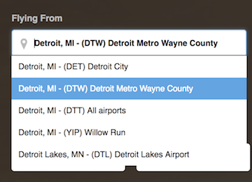

# tiny-complete
[](https://nodei.co/npm/tiny-complete/)

[](https://www.npmjs.com/package/tiny-complete)
[](https://david-dm.org/raymondborkowski/tiny-complete)
[](https://travis-ci.org/raymondborkowski/tiny-complete)
[](https://codecov.io/github/raymondborkowski/tiny-complete?branch=master)
[](https://gitter.im/tiny-complete?utm_source=badge&utm_medium=badge&utm_campaign=pr-badge&utm_content=badge)
[](https://david-dm.org/raymondborkowski/tiny-complete#info=devDependencies)
[](https://app.fossa.io/projects/git%2Bgithub.com%2Fraymondborkowski%2Ftiny-complete?ref=badge_shield)
[](https://img.shields.io/npm/dt/tiny-complete.svg)

Lightweight, dependency free type-ahead/autocomplete solution! Get this running in under 5 minutes!
<br>
<br>
[View Demo](https://raymondborkowski.github.io/tiny-complete/index.html) <br><br>


## Install
`npm i tiny-complete --save`
## The Code
### Example
The html input items on your page that you wish for tiny-complete to be attached:
```html
<div class="tiny-complete">
    <input id="city">
    <input id="city2">
</div>
```
Example of using an array of strings for default values:
```js
var arrayToAddString = ['JFK'];
 
var TC = new TinyComplete({
    id: 'city',
    defaultVals: ['LA','Miami','Detroit','NYC','NYC'],
    onInput: function (filteredVals, query) {
        TC.addValues(arrayToAddString);
    },
    onSelect: function(val) { console.log(val); },
    maxResults: 15,
});
```
Example of using array of objects. Please set object using `key, val` pairs:
```js
var arrayToAddObject = [{
    key: 'JFK',
    val: 'New York (JFK) - United States'
}];
 
var TC2 = new TinyComplete({
    id: 'city2',
    defaultVals: [{key: 'DTW', val: 'Detroit (DTW)'}, {key: 'LAX', val: 'LA'}, {key: 'MIA', val: 'Miami'}, {key: 'NYC', val: 'NYC'}, {key: 'LAX', val: 'LAMP'}],
    onInput: function(filteredVals, query) {
            TC2.addValues(arrayToAddObject);
    },
    onSelect: function(val, key) { console.log(val, key); },
    maxResults: 15,
});
```
### Options

- `id` - A string that matches the value of an id for the input element. In the above example: `city`
- `defaultVals` - An array of strings or objects (key, val) that will be the default items in the drop down container
- `onInput(filteredVals, query)` - On user input, this callback will be executed with the filtered list of options that the user sees and the query that the user entered
- `onSelect(val, key)` - On Select of an option from dropdown list, the callback will be executed with value of the input box, and key (if passed in)
- `maxResults` - The max number of options the user sees in the dropdown container.
    - Default: 10 values

### Publicly exposed methods
- `TC.addValues(array_of_objects_or_strings)` - This will allow you to add new values dynamically to a cache of options for each instance

## Benchmarking Size (`npm package-size`):
|Typeahead Packages  | minified  |  Gzipped |
| ------------- | ------------- | ------------- |
| tiny-complete  | 1.81 KB |812 B|   
| autocomplete | 13.47 KB | 4.46KB|
| react-autocomplete | 16.36 KB | 5.54KB|
| typeahead | 14 KB | 4.7 KB|
| suggestions | 5.19 KB| 1.69 KB|

## Developing and contributing to tiny-complete
### Folder structure
The main body of code is in `index.js`

The tests are in the `spec/unit` directory. Please follow naming convention with `xxxx.spec.js`

### Running tests

We use [Jasmine](https://jasmine.github.io/api/3.0/global) The existing tests are in the spec folder.

Please write tests for new additions. We use codecov to test for complete(100%) unit test coverage.

#### Run all the tests:

`npm test`

### Before submitting a pull request

Please make sure all code supports all versions of node. We write code in ES5 syntax for smaller size and browser compatibility.

We use ESLint for syntax consistency, and the linting rules are included in this repository. Running `npm test` will check the linting rules as well. Please make sure your code has no linting errors before submitting a pull request.

`npm run lint_fix` will also automatically fix any linting errors.

## License

[MIT](https://github.com/raymondborkowski/tiny-complete/blob/master/LICENSE)


[](https://app.fossa.io/projects/git%2Bgithub.com%2Fraymondborkowski%2Ftiny-complete?ref=badge_large)
